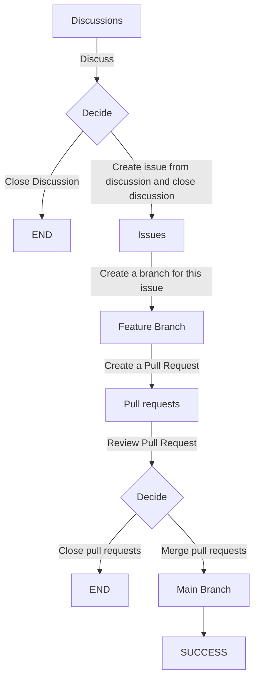
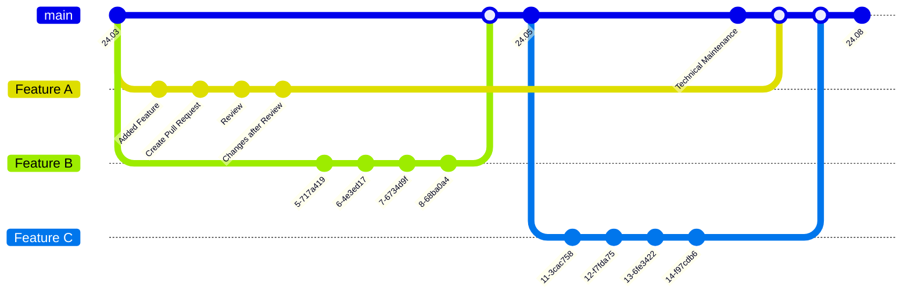
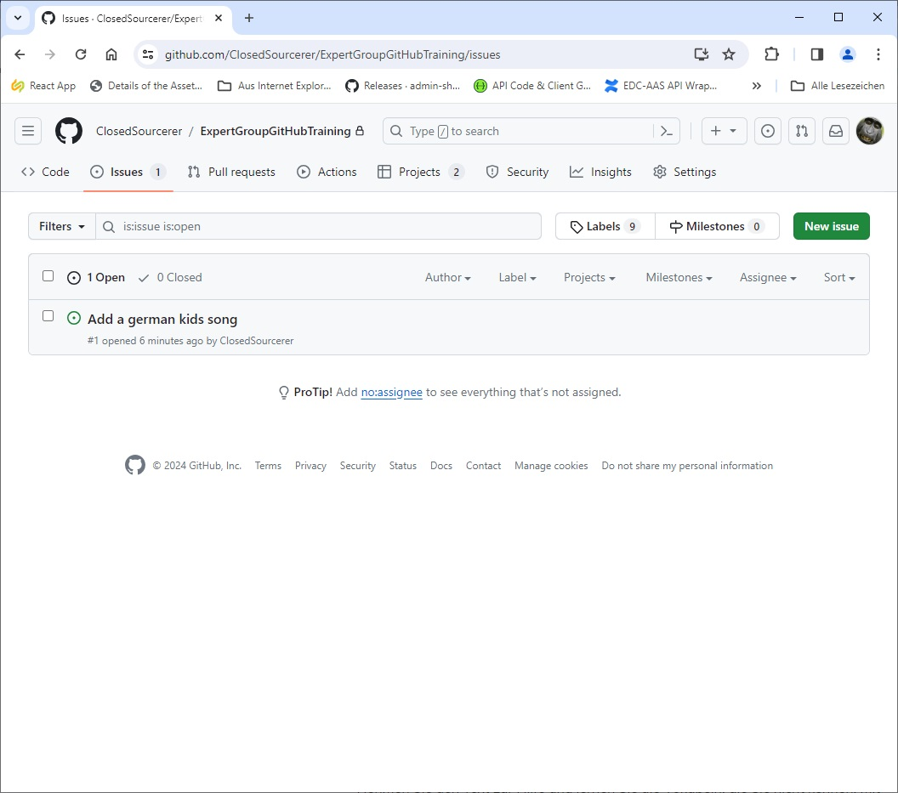
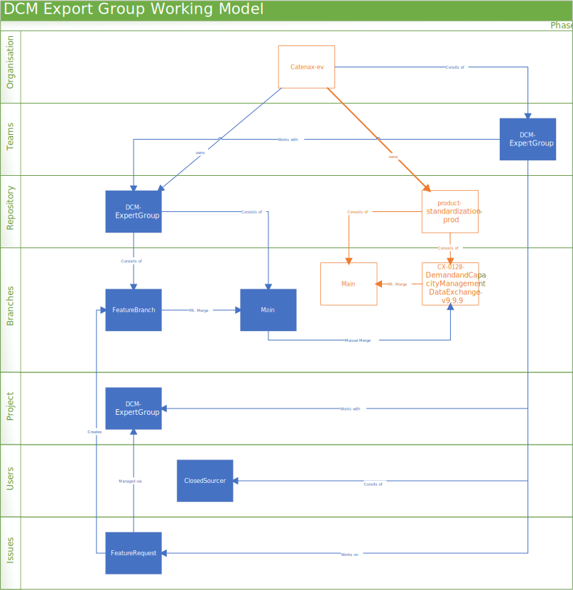

# ExpertGroupGitHubTraining

https://docs.github.com/en

https://docs.github.com/en/get-started/learning-about-github/github-glossary

## Training Tasks:

- Basic Setup
  - Create a GitHub Account --> MUST be done in advance
  - Setup Two Factor Authentication --> SHOULD be done in advance
  - Add name, company and a picture to your account
- Basic GitHub Navigation
  - Find ClosedSourcerer, go to the Expert Group Training Repository, Star the repository,
  - Find catenax-ev and follow it
  - Find stephanbcbauer and have him inite you to catenax-ev, accept the invite
- Basic Process within the training repo: https://github.com/ClosedSourcerer/ExpertGroupGitHubTraining 
  - Start a discussion, participate in another users discussion, create an issue from your discussion (or decide that it is unworthy and close the discussion)
  - Add Assignees to the Issue, add the issue to the project and fill the custom properties
  - Goto the correct project flip through the different views, plan your issue ()
  - Go back to the issue and create a branch from the issue
- Actually Working on a file
  - Select your branch and navigate to one of the MD files that is not README.md
  - Edit the file and commit the change to the branch
  - Create  Pull requests to merge this branch back into main and add ClosedSourcerer as a Reviewer
  - <<Wait for ClosedSourcer to Review and Merge>>
  - Delete the feature branch
- Creating Issues / Discussion directly from an existing file
  - Open one of the md files
  - go to either code or blame view 
  - click on a line number and choose "reference in new discussion" or "reference in new issue"

## History


## Process



- Setup a team
- Setup a repository
  - Wiki
  - Discussions
- Setup a project and link it to the repository
  - Setup your views:
    - board
    - roadmap
    - table
- Plan your project by starting discussions, creating issues and setting them up within the project
- Get yourself a team of people and set them up as commiters, reviewers etc.
- Start: Loop
  - Have your team pull issues
  - Have your team create feature-branches per issue
  - Have your team work on the issues
  - Have your team pull-requests the feature-branch back into the main-branch
  - Do reviews
  - Solve merge conflicts
  - Merge
  - Delete feature-branch
- End: Loop

### Feature Branches





## Main View


- star a repository
  - mark it as a favorite
- watch a repository
  - request email notification
- fork a repository
  - create a copy that is still linked to the original
    - used to make pseudo backups
    - used to start your own thing based on someon elses work

## Branches

- Repositories start with the main branch
  - used to be called master
    - used to be called trunk
- If you create a new branch you must choose an existing branch as the basis for the new one.
- Better to only create branches from main and also merge them back only into main
- Never merge main into another branch
- You can branch a branch
  - We could use this to create a "ReleaseCandidate" branch and then create "Feature" branches from the "ReleaseCandidate" branch 
- A branch is a parallel version of a repository. It is contained within the repository, but does not affect the primary or main branch allowing you to work freely without disrupting the "live" version. When you've made the changes you want to make, you can merge your branch back into the main branch to publish your changes. 

## Commits

- Make changes to a file and commit them into the branch.
- The commit represents the changes to the file
- Commits be be tracked and commented
- A commit, or "revision", is an individual change to a file (or set of files). When you make a commit to save your work, Git creates a unique ID (a.k.a. the "SHA" or "hash") that allows you to keep record of the specific changes committed along with who made them and when. Commits usually contain a commit message which is a brief description of what changes were made.

## Merge

- Merges apply changes from one branch into another branch
- We merge via pull requests
- Never merge main into another branch
- We merge our multiple feature branches into our release candidate branch and than that branch finally back into main
- Merging takes the changes from one branch (in the same repository or from a fork), and applies them into another. This often happens as a "pull request" (which can be thought of as a request to merge), or via the command line. A merge can be done through a pull request via the GitHub.com web interface if there are no conflicting changes, or can always be done via the command line.

## Merge conflict
- Can appear when making a pull requests
- Can appear when multiple feature branches edit the same file and then try merging back into the main branch
- Some merge conflicts can be solved automatically
- A difference that occurs between merged branches. Merge conflicts happen when people make different changes to the same line of the same file, or when one person edits a file and another person deletes the same file. The merge conflict must be resolved before you can merge the branches.

## Pull Requests

- Used to requests that a branch gets merged into another branch
- Can be combined with a review process
- Develop your feature in a feature branch and then request to have it merged back into the main branch
- Merge conflicts have to be resolved before the merge can be executed
- Pull requests are proposed changes to a repository submitted by a user and accepted or rejected by a repository's collaborators. Like issues, pull requests each have their own discussion forum.

## Forks

- A copy of antoher repository, that still knows its source
- You can sync with the source and pull requests into the source
- A fork is a personal copy of another user's repository that lives on your account. Forks allow you to freely make changes to a project without affecting the original upstream repository. You can also open a pull request in the upstream repository and keep your fork synced with the latest changes since both repositories are still connected.

## Issues




- Create Issues
  - Assign them to projects
  - Assign them to users
  - Create a Branch directly from an issue


## Projects


- You only need one project
- Projects support multiple views
- Projects support workflows

### Table


- Have a detailed view of multiple items at once, including custom fields

### Board


- Transiton items through status, akin to Kanban

### Roadmap


- Plan items on a timeline, using Start/End Dates or predefined Iterations

## Discussions


- Announcements
- General
- Ideas
- Polls
- Q&A
- Show and Tell

- Ability to create Issues from the Discussion!

## View a File

### Preview


- Have a look at how GitHub is going to render this file
  - Image support
  - Latex support
  - Markdown support

**The Cauchy-Schwarz Inequality**

https://latex.codecogs.com/eqneditor/editor.php

```math
\left( \sum_{k=1}^n a_k b_k \right)^2 \leq \left( \sum_{k=1}^n a_k^2 \right) \left( \sum_{k=1}^n b_k^2 \right)
```

**Polygons**

```stl
solid cube_corner
  facet normal 0.0 -1.0 0.0
    outer loop
      vertex 0.0 0.0 0.0
      vertex 1.0 0.0 0.0
      vertex 0.0 0.0 1.0
    endloop
  endfacet
  facet normal 0.0 0.0 -1.0
    outer loop
      vertex 0.0 0.0 0.0
      vertex 0.0 1.0 0.0
      vertex 1.0 0.0 0.0
    endloop
  endfacet
  facet normal -1.0 0.0 0.0
    outer loop
      vertex 0.0 0.0 0.0
      vertex 0.0 0.0 1.0
      vertex 0.0 1.0 0.0
    endloop
  endfacet
  facet normal 0.577 0.577 0.577
    outer loop
      vertex 1.0 0.0 0.0
      vertex 0.0 1.0 0.0
      vertex 0.0 0.0 1.0
    endloop
  endfacet
endsolid
```

**Some Flowchart**

https://mermaid.live/


### Code 


- Have a look at tha actual file content
  - This is also the view the markdown files are edited in
  - https://docs.github.com/en/get-started/writing-on-github/getting-started-with-writing-and-formatting-on-github/basic-writing-and-formatting-syntax 
- Click on the line number to
  - Open a new issue
  - Open a new discussion
  - Switch to GIT blame

### Blame


- Have a look at which commit made which lines
- Use this view to find out which change made the document as it currently is
- Click on the line number to
  - Open a new issue
  - Open a new discussion

## Local Toolchain

### Version Control System

#### Git Desktop

https://desktop.github.com/

### Code Editor

#### Visual Studio Code

https://code.visualstudio.com/

## Conclude Training
- Lets have a look at our working model


-  Lets have a look at the new Network graph
  -  https://github.com/ClosedSourcerer/ExpertGroupGitHubTraining/network  
- Lets create a Repository we can work on
  - https://github.com/orgs/catenax-eV/repositories 
Lets create Feature-Branches if applicable
 - Lets create a new team within catena-X ev
  - https://github.com/orgs/catenax-eV/teams
    - DCM Expert Group
- Lets create a new project within catena-x ev
  - https://github.com/orgs/catenax-eV/projects 
    - DCM Expert Group

### How do these things interlink with each other?


